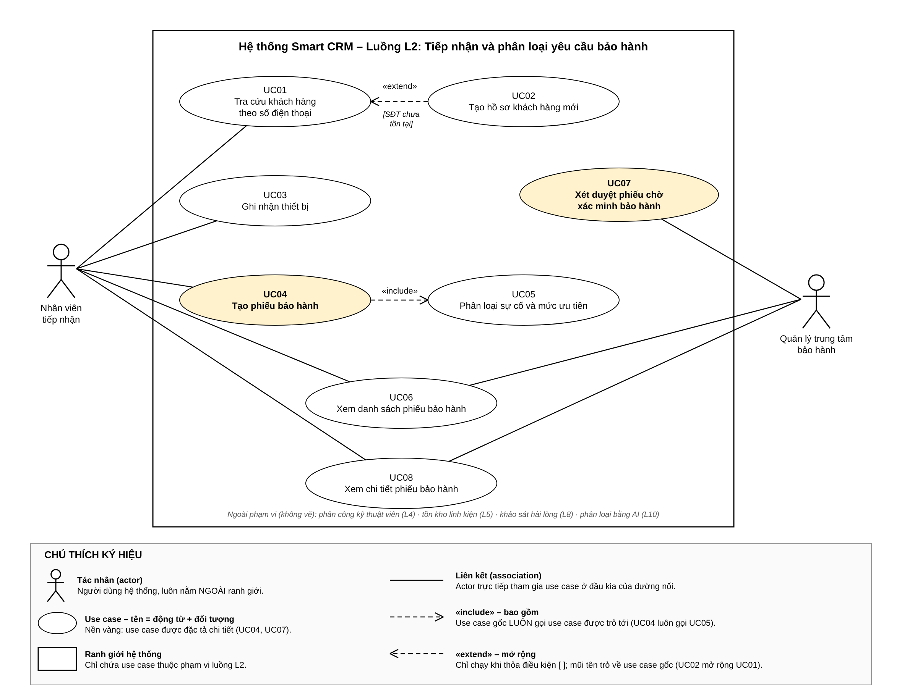

# SRS rút gọn – Smart CRM · Luồng L2: Tiếp nhận và phân loại yêu cầu bảo hành

Sinh viên: Nguyễn Hoàng Tuấn – MSSV 2374802010542 – Track SE · Học phần Chuyên đề tốt nghiệp 1 – Bài tập 1

> Nguồn markdown của Mục 1 (SRS) và Mục 2 (Use Case) trong file PDF nộp. Sơ đồ gốc: `usecase.drawio`, `architecture.drawio`, `erd.drawio`, `wireframe.drawio`.

# MỤC 1 – BẢN SRS RÚT GỌN

## 1.1. Giới thiệu, phạm vi và bảng thuật ngữ

**Bối cảnh.** Mekong Mobile vận hành chuỗi cửa hàng và các trung tâm bảo hành. Hiện nay nhân viên ghi phiếu bảo hành bằng giấy nên khó theo dõi trạng thái và hạn cam kết (vấn đề V2), mô tả lỗi viết tự do, không phân nhóm nên không thống kê được (V8). Tài liệu này đặc tả module số hoá khâu tiếp nhận trong hệ thống Smart CRM.

**Luồng nghiệp vụ đã chọn – L2: Tiếp nhận và phân loại yêu cầu bảo hành (track SE).** Bắt đầu khi khách hàng mang thiết bị đến quầy của trung tâm bảo hành. Nhân viên tiếp nhận tra cứu khách hàng theo số điện thoại, ghi nhận thiết bị, nhập mô tả lỗi, chọn nhóm sự cố và mức ưu tiên. Hệ thống kiểm tra điều kiện bảo hành, tính hạn cam kết và tạo phiếu bảo hành. Luồng kết thúc khi phiếu bảo hành được lưu ở trạng thái “Mới”. Nếu thiếu ngày mua, phiếu ở trạng thái “Chờ xác minh bảo hành” và Quản lý trung tâm bảo hành xét duyệt rồi chuyển sang “Mới”.

**Điều em CHỦ Ý KHÔNG làm (mức WON'T của MoSCoW):**

| Nội dung không làm | Lý do |
|---|---|
| Phân công kỹ thuật viên, đặt lịch hẹn | Thuộc luồng L4; L2 kết thúc khi phiếu ở trạng thái “Mới”. |
| Quản lý tồn kho linh kiện; khảo sát hài lòng | Thuộc luồng L5 và L8. |
| Phân loại nhóm sự cố tự động bằng AI | Thuộc luồng L10 (track AI); L2 phân loại thủ công theo danh mục. |
| Gửi SMS/Zalo báo mã phiếu cho khách hàng | Cần tích hợp hệ thống ngoài; nhân viên đọc mã phiếu trực tiếp cho khách. |
| Dashboard điều hành toàn công ty | Thuộc luồng L6 (track DA). |
| Đăng ký, quản lý tài khoản; danh mục trung tâm bảo hành | Dùng dữ liệu mẫu nạp sẵn; chỉ lưu mã trung tâm (center_code). |
| Sửa nội dung hoặc xóa phiếu sau khi tạo | Không cần cho mục tiêu tiếp nhận; phiếu không bị xóa vật lý. |

**Bảng thuật ngữ.** Mỗi khái niệm chỉ dùng MỘT tên trong SRS, Use Case, kiến trúc, ERD và wireframe. Tên tiếng Anh chỉ dùng cho bảng và cột CSDL. Không dùng các tên “ticket”, “đơn sửa chữa”, “yêu cầu hỗ trợ” trong phần nghiệp vụ.

| Thuật ngữ | Định nghĩa dùng trong toàn tài liệu | Tên trong CSDL |
|---|---|---|
| Khách hàng | Cá nhân mua sản phẩm hoặc dùng dịch vụ của Mekong Mobile, nhận diện bằng số điện thoại. | customer |
| Số điện thoại | Chuỗi 10 chữ số bắt đầu bằng 0, đã chuẩn hoá theo QT-02. | customer.phone |
| Thiết bị | Một máy cụ thể của khách hàng, nhận diện bằng Serial/IMEI. | device |
| Serial/IMEI | Mã định danh duy nhất của thiết bị. | device.serial_imei |
| Ngày mua; Số tháng bảo hành | Căn cứ để kiểm tra điều kiện bảo hành. Ngày mua có thể trống. | device.purchase_date; device.warranty_months |
| Phiếu bảo hành | Yêu cầu bảo hành đã được ghi nhận, có mã phiếu duy nhất. | ticket |
| Mã phiếu | Dạng BH-NNNNNN/YYYY, ví dụ BH-000123/2026 (QT-A2). | ticket.ticket_code |
| Mô tả lỗi | Lời mô tả hiện tượng lỗi do khách hàng cung cấp. | ticket.issue_desc |
| Nhóm sự cố | Màn hình, Pin, Sạc, Phần mềm, Nước vào, Khác. | issue_category |
| Mức ưu tiên | Cao / Trung bình / Thấp; quyết định hạn cam kết. | ticket.priority (CAO, TRUNG_BINH, THAP) |
| Hạn cam kết | Thời điểm muộn nhất phải xử lý xong phiếu (SLA), tính theo QT-04. | ticket.due_at |
| Thời điểm tiếp nhận | Thời điểm phiếu bảo hành được tạo. | ticket.received_at |
| Kết quả kiểm tra bảo hành | Còn bảo hành / Hết bảo hành / Chưa xác minh (thiếu ngày mua). | ticket.warranty_result |
| Trạng thái phiếu | Trong L2 chỉ có: “Mới” và “Chờ xác minh bảo hành”. | ticket.status (MOI, CHO_XAC_MINH) |
| Xét duyệt | Quyết định Chấp nhận / Không chấp nhận bảo hành của Quản lý trung tâm bảo hành cho phiếu “Chờ xác minh bảo hành”. | ticket.warranty_result + ticket_status_log.note |
| Lịch sử trạng thái phiếu | Bản ghi mỗi lần đổi trạng thái: người thực hiện, thời điểm, từ → sang, ghi chú. | ticket_status_log |
| Trung tâm | Trung tâm bảo hành nơi tiếp nhận; nhận diện bằng mã trung tâm (ví dụ TT-Q1). | center_code |
| Nhân viên tiếp nhận; Quản lý trung tâm bảo hành | Hai vai trò người dùng của luồng L2 (mục 1.2). | staff.role (NV_TIEP_NHAN, QL_TRUNG_TAM) |

## 1.2. Các bên liên quan và vai trò

| Vai trò | Được làm | Không được làm |
|---|---|---|
| **Nhân viên tiếp nhận** (actor chính) | Tra cứu khách hàng; tạo hồ sơ khách hàng mới; ghi nhận thiết bị; tạo phiếu bảo hành; phân loại sự cố và mức ưu tiên; xem danh sách và chi tiết phiếu của trung tâm mình. Số điện thoại hiển thị dạng che. | Xét duyệt phiếu “Chờ xác minh bảo hành”; xem phiếu của trung tâm khác; xóa phiếu; phân công kỹ thuật viên. |
| **Quản lý trung tâm bảo hành** | Xem danh sách và chi tiết phiếu của trung tâm mình (thấy số điện thoại đầy đủ); xét duyệt phiếu “Chờ xác minh bảo hành” kèm ghi chú. | Xét duyệt phiếu của trung tâm khác; ghi đè quyết định xét duyệt đã lưu; sửa mô tả lỗi, thiết bị trên phiếu; xóa phiếu. |
| Khách hàng (không dùng hệ thống) | Cung cấp số điện thoại, thiết bị, mô tả lỗi, chứng từ mua hàng; nhận mã phiếu và hạn cam kết. | Không đăng nhập, không thao tác trực tiếp. |
| Kỹ thuật viên (luồng sau) | Nhận phiếu ở trạng thái “Mới” trong luồng L4. | Ngoài phạm vi L2. |

## 1.3. Yêu cầu chức năng và User Story

| Mã | Yêu cầu chức năng (kiểm chứng được) | US | MoSCoW |
|---|---|---|---|
| FR1 | Hệ thống cho phép tra cứu khách hàng theo số điện thoại: chuẩn hoá đầu vào theo QT-02 rồi trả về đúng 1 hồ sơ nếu tồn tại; nếu không, hiển thị “Chưa có khách hàng với số điện thoại này”. | US1 | MUST |
| FR2 | Hệ thống cho phép tạo hồ sơ khách hàng mới gồm họ tên và số điện thoại; từ chối lưu nếu số điện thoại sau chuẩn hoá không đủ 10 chữ số bắt đầu bằng 0 hoặc đã tồn tại (QT-01). | US2 | SHOULD |
| FR3 | Hệ thống cho phép ghi nhận thiết bị (Serial/IMEI, tên model, ngày mua, số tháng bảo hành) và liên kết với khách hàng; từ chối với HTTP 409 nếu Serial/IMEI đã thuộc khách hàng khác (QT-03). | US3 | SHOULD |
| FR4 | Hệ thống tạo phiếu bảo hành có mã phiếu duy nhất (QT-A2), thời điểm tiếp nhận, trung tâm, nhân viên tiếp nhận, mô tả lỗi, và ghi dòng lịch sử trạng thái đầu tiên trong cùng một giao dịch; không tạo phiếu khi thiếu dữ liệu bắt buộc. | US4 | MUST |
| FR5 | Khi tạo phiếu, hệ thống tự kiểm tra điều kiện bảo hành theo QT-05 và gán kết quả kiểm tra bảo hành; phiếu “Chưa xác minh” được lưu ở trạng thái “Chờ xác minh bảo hành”, các phiếu khác ở trạng thái “Mới”. | US4 | MUST |
| FR6 | Hệ thống cho phép chọn nhóm sự cố đang hoạt động, đề xuất mức ưu tiên mặc định theo nhóm (QT-A1), cho phép đổi mức ưu tiên và tự sinh hạn cam kết theo QT-04. | US5 | MUST |
| FR7 | Hệ thống cho phép Quản lý trung tâm bảo hành xét duyệt phiếu “Chờ xác minh bảo hành” (Chấp nhận / Không chấp nhận, ghi chú bắt buộc); lưu người, thời điểm, ghi chú vào lịch sử và chuyển phiếu sang “Mới” (QT-A3). | US6 | SHOULD |
| FR8 | Hệ thống hiển thị danh sách phiếu bảo hành của trung tâm người dùng, lọc theo khoảng ngày tiếp nhận, trạng thái, mức ưu tiên, mã phiếu hoặc số điện thoại, phân trang 20 dòng; mở chi tiết phiếu kèm lịch sử trạng thái. | US7 | SHOULD |

**User Story** – viết theo khuôn “Là <vai trò>, tôi muốn <mục tiêu> để <giá trị>”, đã rà theo INVEST và bốn lỗi thường gặp. Story MUST có tiêu chí chấp nhận Given–When–Then (GWT), mỗi story MUST có ít nhất một tiêu chí cho trường hợp ngoại lệ.

| Mã | User Story | MoSCoW |
|---|---|---|
| US1 | Là nhân viên tiếp nhận, tôi muốn tra cứu khách hàng bằng số điện thoại để không tạo hồ sơ khách hàng trùng lặp. | MUST |
| US2 | Là nhân viên tiếp nhận, tôi muốn tạo hồ sơ khách hàng mới ngay tại quầy khi số điện thoại chưa có để tiếp tục tiếp nhận mà không phải chuyển màn hình. | SHOULD |
| US3 | Là nhân viên tiếp nhận, tôi muốn ghi nhận thiết bị theo Serial/IMEI để phiếu bảo hành gắn đúng chiếc máy của khách hàng. | SHOULD |
| US4 | Là nhân viên tiếp nhận, tôi muốn tạo phiếu bảo hành có mã phiếu duy nhất để khách hàng nhận mã phiếu và hạn cam kết ngay tại quầy. | MUST |
| US5 | Là nhân viên tiếp nhận, tôi muốn phân loại nhóm sự cố và mức ưu tiên cho phiếu để hạn cam kết phản ánh đúng mức độ khẩn cấp. | MUST |
| US6 | Là quản lý trung tâm bảo hành, tôi muốn xét duyệt các phiếu chờ xác minh bảo hành để kiểm soát việc áp dụng bảo hành khi khách hàng không có ngày mua. | SHOULD |
| US7 | Là quản lý trung tâm bảo hành, tôi muốn xem danh sách phiếu bảo hành của trung tâm theo ngày và trạng thái để nắm khối lượng tiếp nhận và phát hiện phiếu đang chờ xét duyệt. | SHOULD |

**Tiêu chí chấp nhận cho story MUST:**

| Mã | Given – When – Then |
|---|---|
| AC1.1 | Given số điện thoại 0901234567 đã có trong hệ thống; When nhân viên nhập “+84 901 234 567” và chọn Tra cứu; Then hệ thống hiển thị hồ sơ Nguyễn Minh Anh và không tạo hồ sơ mới. |
| AC1.2 (ngoại lệ) | Given số điện thoại chưa tồn tại; When tra cứu; Then hiển thị “Chưa có khách hàng với số điện thoại này” và nút “Tạo khách hàng mới”. |
| AC1.3 (ngoại lệ) | Given nhập “09012”; When tra cứu; Then hệ thống báo số điện thoại không hợp lệ và không truy vấn CSDL. |
| AC4.1 | Given thiết bị có ngày mua 15/03/2026, 12 tháng bảo hành; When tạo phiếu lúc 02/10/2026 10:00; Then phiếu có mã phiếu duy nhất, kết quả kiểm tra bảo hành “Còn bảo hành”, trạng thái “Mới” và 1 dòng lịch sử trạng thái. |
| AC4.2 (ngoại lệ) | Given thiết bị không có ngày mua; When tạo phiếu; Then kết quả kiểm tra bảo hành “Chưa xác minh” và phiếu ở trạng thái “Chờ xác minh bảo hành”. |
| AC4.3 (ngoại lệ) | Given mô tả lỗi để trống; When chọn Tạo phiếu bảo hành; Then không tạo phiếu và hệ thống chỉ rõ trường bắt buộc còn thiếu. |
| AC5.1 | Given nhóm sự cố Màn hình (mặc định Trung bình), tiếp nhận thứ Sáu 02/10/2026 10:00; When lưu phiếu; Then hạn cam kết là 06/10/2026 10:00 (72 giờ làm việc, bỏ Chủ nhật). |
| AC5.2 | Given nhân viên đổi mức ưu tiên thành Cao; When lưu; Then hạn cam kết là 03/10/2026 10:00. |
| AC5.3 (ngoại lệ) | Given nhóm sự cố đã ngừng sử dụng; When lưu; Then hệ thống từ chối và yêu cầu chọn nhóm khác. |

## 1.4. Yêu cầu phi chức năng

| Mã | Loại | Yêu cầu – ngưỡng số đo được | Cách đo |
|---|---|---|---|
| NFR1 | Hiệu năng | 95% yêu cầu tra cứu khách hàng theo số điện thoại trả kết quả trong ≤ 1 giây với 50.000 khách hàng và 50 người dùng đồng thời. | k6, 5 phút, môi trường kiểm thử |
| NFR2 | Hiệu năng, đúng đắn | 95% thao tác tạo phiếu hợp lệ hoàn tất trong ≤ 3 giây với 100 yêu cầu đồng thời; 0 mã phiếu trùng trong 1.000 yêu cầu tạo phiếu đồng thời. | k6 + truy vấn đếm trùng |
| NFR3 | Hiệu năng | Danh sách phiếu bảo hành (trang 20 dòng, có lọc) hiển thị trong ≤ 2 giây với 10.000 phiếu. | Đo thời gian API + EXPLAIN ANALYZE |
| NFR4 | Bảo mật | 100% endpoint yêu cầu JWT hợp lệ (thiếu → 401); 100% yêu cầu sai vai trò hoặc khác trung tâm trả 403; 100% số điện thoại trả cho vai trò Nhân viên tiếp nhận được che 4 chữ số giữa (090****567). | Bộ test API tự động |
| NFR5 | Toàn vẹn dữ liệu | 0 phiếu bảo hành bị lưu dở qua 200 lần giả lập lỗi giữa chừng; 100% phiếu có ≥ 1 dòng lịch sử trạng thái. | Test chèn lỗi + truy vấn đối soát |
| NFR6 | Bảo trì | Đổi số giờ của hạn cam kết hoặc ngày làm việc chỉ sửa đúng 1 tệp cấu hình (sla.config.json), 0 thay đổi ở lớp API và giao diện. | git diff khi đổi cấu hình |

## 1.5. Ràng buộc và quy tắc nghiệp vụ

Mã QT-xx giữ nguyên đánh số của Bảng 9.1 trong case study (đã dùng ở bài Buổi 4). Mã QT-Ax là quy tắc em bổ sung từ phân tích.

| Mã | Quy tắc | Nguồn |
|---|---|---|
| QT-01 | Số điện thoại khách hàng là duy nhất; nếu đã tồn tại thì dùng hồ sơ hiện có. | Bảng 9.1 |
| QT-02 | Chuẩn hoá số điện thoại: bỏ khoảng trắng, dấu chấm, gạch nối; đổi tiền tố +84/84 thành 0; kết quả phải là 10 chữ số bắt đầu bằng 0. | Bảng 9.1 |
| QT-03 | Serial/IMEI là duy nhất; một thiết bị chỉ thuộc một khách hàng tại một thời điểm. | Bảng 9.1 |
| QT-04 | Hạn cam kết = thời điểm tiếp nhận + 24 giờ (Cao) / 72 giờ (Trung bình) / 120 giờ (Thấp), chỉ tính ngày làm việc thứ Hai đến thứ Bảy. | Bảng 9.1 |
| QT-05 | Còn bảo hành nếu ngày tiếp nhận ≤ ngày mua + số tháng bảo hành; quá hạn là Hết bảo hành; thiếu ngày mua là Chưa xác minh và cần Quản lý trung tâm bảo hành xét duyệt. | Bảng 9.1 |
| QT-06 | Mọi lần chuyển trạng thái phiếu đều ghi lịch sử trạng thái phiếu (người thực hiện, thời điểm, từ → sang). | Bảng 9.1 |
| QT-14 | Nhân viên chỉ xem dữ liệu của trung tâm mình; quản lý trung tâm xem trung tâm mình phụ trách. | Bảng 9.1 |
| QT-15 | Số điện thoại hiển thị dạng che cho mọi vai trò trừ quản lý. | Bảng 9.1 |
| QT-A1 | Mức ưu tiên mặc định theo nhóm sự cố: Nước vào → Cao; Màn hình, Pin, Sạc → Trung bình; Phần mềm, Khác → Thấp. Nhân viên tiếp nhận được đổi. | Phân tích của em |
| QT-A2 | Mã phiếu có dạng BH-NNNNNN/YYYY; NNNNNN lấy từ bộ đếm của CSDL, không tái sử dụng. | Phân tích của em |
| QT-A3 | Quyết định xét duyệt đã lưu không được ghi đè; ghi chú là bắt buộc. | Phân tích của em |

**Ràng buộc kỹ thuật:** Node.js 20 LTS + Express, PostgreSQL 16, React; prototype chạy được trước buổi 12. BT1 chỉ gồm tài liệu và sơ đồ, không có mã nguồn.

## 1.6. Bảng truy vết yêu cầu

Đọc theo hàng: mỗi FR đủ User Story, use case, bảng dữ liệu và màn hình. Đọc theo cột “Bảng dữ liệu”: cả 6 bảng của ERD đều xuất hiện, không có bảng cô lập. Không có ô trống.

| FR | User Story | Use Case | MoSCoW | Bảng dữ liệu | Màn hình |
|---|---|---|---|---|---|
| FR1 | US1 | UC01, UC04 | MUST | customer | M2 ① |
| FR2 | US2 | UC02 | SHOULD | customer | M2 ① |
| FR3 | US3 | UC03 | SHOULD | device, customer | M2 ② |
| FR4 | US4 | UC04 | MUST | ticket, ticket_status_log, staff | M2, M3 |
| FR5 | US4 | UC04 | MUST | ticket, device | M2 ④, M3 |
| FR6 | US5 | UC05 | MUST | ticket, issue_category | M2 ③ ④ |
| FR7 | US6 | UC07 | SHOULD | ticket, ticket_status_log, staff | M3 |
| FR8 | US7 | UC06, UC08 | SHOULD | ticket, customer, issue_category, ticket_status_log | M1, M3 |

# MỤC 2 – USE CASE

## 2.1. Use Case Diagram

| Mã | Use case | Actor | FR |
|---|---|---|---|
| UC01 | Tra cứu khách hàng theo số điện thoại | Nhân viên tiếp nhận | FR1 |
| UC02 | Tạo hồ sơ khách hàng mới («extend» UC01 khi số điện thoại chưa tồn tại) | Nhân viên tiếp nhận | FR2 |
| UC03 | Ghi nhận thiết bị | Nhân viên tiếp nhận | FR3 |
| UC04 | Tạo phiếu bảo hành («include» UC05) | Nhân viên tiếp nhận | FR1, FR4, FR5 |
| UC05 | Phân loại sự cố và mức ưu tiên | Nhân viên tiếp nhận | FR6 |
| UC06 | Xem danh sách phiếu bảo hành | Cả hai vai trò | FR8 |
| UC07 | Xét duyệt phiếu chờ xác minh bảo hành | Quản lý trung tâm bảo hành | FR7 |
| UC08 | Xem chi tiết phiếu bảo hành | Cả hai vai trò | FR8 |

## 2.2. Đặc tả use case chính

### UC04 – Tạo phiếu bảo hành

| Thuộc tính | Đặc tả |
|---|---|
| Actor chính | Nhân viên tiếp nhận |
| Mục tiêu | Tạo phiếu bảo hành có mã phiếu duy nhất, kết quả kiểm tra bảo hành và hạn cam kết cho thiết bị khách hàng mang đến. |
| Điều kiện trước | Nhân viên tiếp nhận đã đăng nhập, thuộc một trung tâm; danh mục nhóm sự cố đã có dữ liệu. |
| Điều kiện sau (thành công) | Phiếu bảo hành được lưu với mã phiếu, thời điểm tiếp nhận, nhóm sự cố, mức ưu tiên, hạn cam kết, kết quả kiểm tra bảo hành, trạng thái “Mới” hoặc “Chờ xác minh bảo hành”; có 1 dòng lịch sử trạng thái phiếu. |
| Điều kiện sau (thất bại) | Không có phiếu nào được lưu một phần (NFR5). |
| User Story liên quan | US1, US2, US3, US4, US5 |
| Luồng chính | 1. Nhân viên tiếp nhận nhập số điện thoại và chọn Tra cứu. 2. Hệ thống chuẩn hoá số điện thoại theo QT-02. 3. Hệ thống tìm khách hàng và hiển thị họ tên, số điện thoại dạng che (UC01). 4. Nhân viên tiếp nhận nhập Serial/IMEI và chọn Tra cứu. 5. Hệ thống tìm thiết bị; nếu chưa có, nhân viên nhập tên model, ngày mua, số tháng bảo hành và hệ thống liên kết thiết bị với khách hàng (UC03). 6. Nhân viên tiếp nhận nhập mô tả lỗi và chọn nhóm sự cố (UC05). 7. Hệ thống đề xuất mức ưu tiên mặc định theo QT-A1; nhân viên giữ hoặc đổi. 8. Hệ thống kiểm tra điều kiện bảo hành (QT-05), tính hạn cam kết (QT-04) và hiển thị ở khung ④ của M2. 9. Nhân viên tiếp nhận chọn “Tạo phiếu bảo hành”. 10. Hệ thống kiểm tra dữ liệu bắt buộc, sinh mã phiếu (QT-A2), lưu phiếu ở trạng thái “Mới” và dòng lịch sử trạng thái đầu tiên trong một giao dịch. 11. Hệ thống thông báo “Đã tạo phiếu <mã phiếu>” và mở M3. |
| Luồng ngoại lệ | 2a. Số điện thoại không chuẩn hoá được thành 10 chữ số bắt đầu bằng 0: hệ thống báo lỗi dưới ô số điện thoại; quay lại bước 1. 3a. Không tìm thấy khách hàng: hệ thống hiển thị “Chưa có khách hàng với số điện thoại này” và nút “Tạo khách hàng mới”; nhân viên nhập họ tên, hệ thống lưu khách hàng (UC02); tiếp tục bước 4. 5a. Serial/IMEI đã thuộc khách hàng khác: hệ thống từ chối liên kết (409) và báo xung đột; nhân viên kiểm tra lại Serial/IMEI; nếu không giải quyết được thì use case dừng, không tạo phiếu. 6a. Nhóm sự cố đã ngừng sử dụng: hệ thống yêu cầu chọn nhóm khác; quay lại bước 6. 8a. Thiết bị không có ngày mua: kết quả kiểm tra bảo hành là “Chưa xác minh”; phiếu sẽ được lưu ở trạng thái “Chờ xác minh bảo hành” và chờ UC07; tiếp tục bước 9. 10a. Thiếu dữ liệu bắt buộc hoặc lỗi khi lưu: hệ thống hủy toàn bộ giao dịch, không tạo phiếu, chỉ rõ trường còn thiếu; quay lại bước 6. |

### UC07 – Xét duyệt phiếu chờ xác minh bảo hành

| Thuộc tính | Đặc tả |
|---|---|
| Actor chính | Quản lý trung tâm bảo hành |
| Mục tiêu | Quyết định có áp dụng bảo hành cho phiếu thiếu ngày mua hay không, có ghi chú làm căn cứ. |
| Điều kiện trước | Quản lý đã đăng nhập; có ít nhất một phiếu “Chờ xác minh bảo hành” thuộc trung tâm mình. |
| Điều kiện sau (thành công) | Kết quả kiểm tra bảo hành = Còn bảo hành (chấp nhận) hoặc Hết bảo hành (không chấp nhận); trạng thái phiếu = “Mới”; có dòng lịch sử trạng thái ghi người xét duyệt, thời điểm, ghi chú. |
| User Story liên quan | US6, US7 |
| Luồng chính | 1. Quản lý mở M1 và lọc trạng thái “Chờ xác minh bảo hành”. 2. Hệ thống hiển thị các phiếu của trung tâm quản lý phụ trách. 3. Quản lý chọn một phiếu; hệ thống mở M3 kèm khung “Xét duyệt bảo hành”. 4. Quản lý đối chiếu chứng từ khách hàng cung cấp và chọn Chấp nhận hoặc Không chấp nhận bảo hành. 5. Quản lý nhập ghi chú và chọn “Lưu quyết định”. 6. Hệ thống kiểm tra vai trò, trung tâm và phiếu còn ở trạng thái “Chờ xác minh bảo hành”. 7. Hệ thống cập nhật kết quả kiểm tra bảo hành, chuyển trạng thái sang “Mới” và thêm dòng lịch sử trạng thái trong một giao dịch. 8. Hệ thống hiển thị kết quả và lịch sử mới trên M3. |
| Luồng ngoại lệ | 2a. Không có phiếu nào chờ xác minh: hiển thị danh sách trống kèm thông báo, không báo lỗi; use case kết thúc. 5a. Ghi chú để trống: hệ thống không lưu và báo “Ghi chú là bắt buộc”; quay lại bước 5. 6a. Phiếu đã được xét duyệt bởi người khác: hệ thống từ chối (409), không ghi đè (QT-A3), tải lại M3. 6b. Phiếu thuộc trung tâm khác hoặc người dùng không phải quản lý: hệ thống trả 403 và không lưu. |
